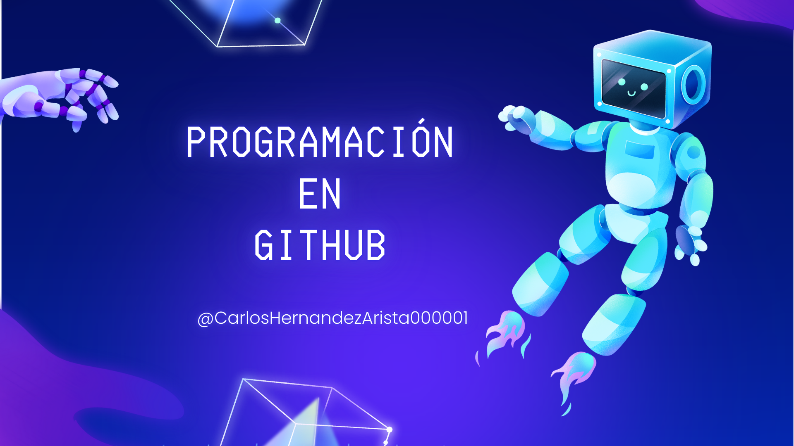

# 

  🌟¡Bienvenid@ a nuestro rincón especial! 🌟👑

#### Comunidad dedicada a aprender y mas conocimientos en  programación y tecnología. Estamos aquí para aprender juntos, compartir experiencias, resolver desafíos y ayudar a cada miembro para que alcance sus metas.
# Acerca de mi 😎
### Soy una persona calmada a la que le gusta jugar y aprender sobre programación y cómo funcionan las computadoras. que usamos todos los días, y aparte puedo realizar estas cosas.
## Mantenimiento Preventivo
## Mantenimiento Correctivo 
## Programacion desde Cero/
## Para mas información comunicate por Correo  carloshernandezarista@gmail.com
# Proyectos 📈
### Estoy comenzando mi camino en la programación y me encanta explorar nuevas tecnologías y resolver problemas.
# Tecnologias 💻

<!--
**CarlosHernandezArista000001/CarlosHernandezArista000001** is a ✨ _special_ ✨ repository because its `README.md` (this file) appears on your GitHub profile.

Here are some ideas to get you started:

- 🔭 I’m currently working on ...
- 🌱 I’m currently learning ...

- 👯 I’m looking to collaborate on ...
- 🤔 I’m looking for help with ...
- 💬 Ask me about ..
- 📫 How to reach me: ...
- ⚡ Fun fact: ...
-->

